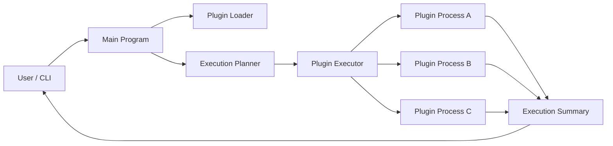
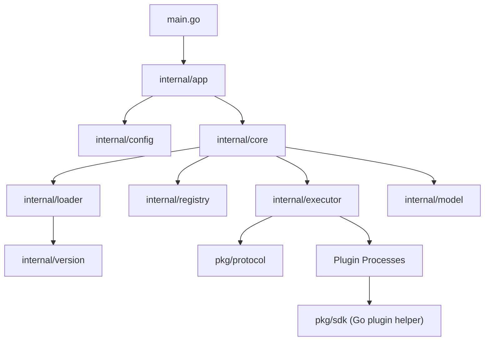
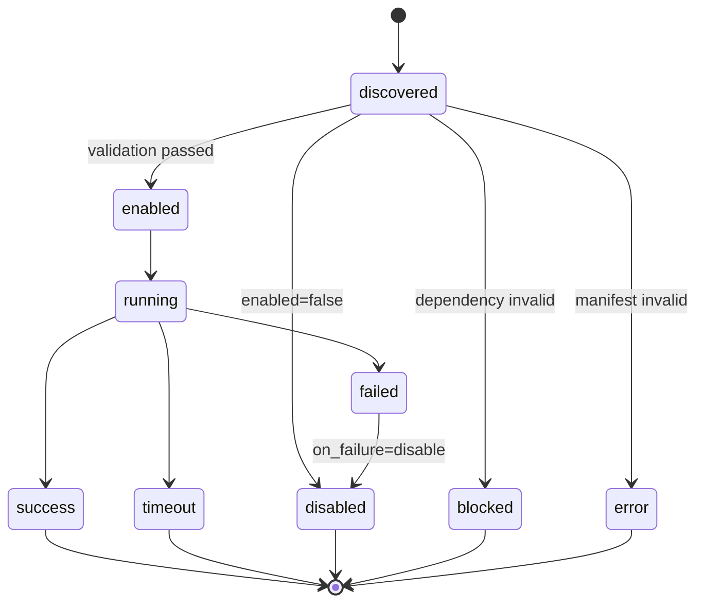
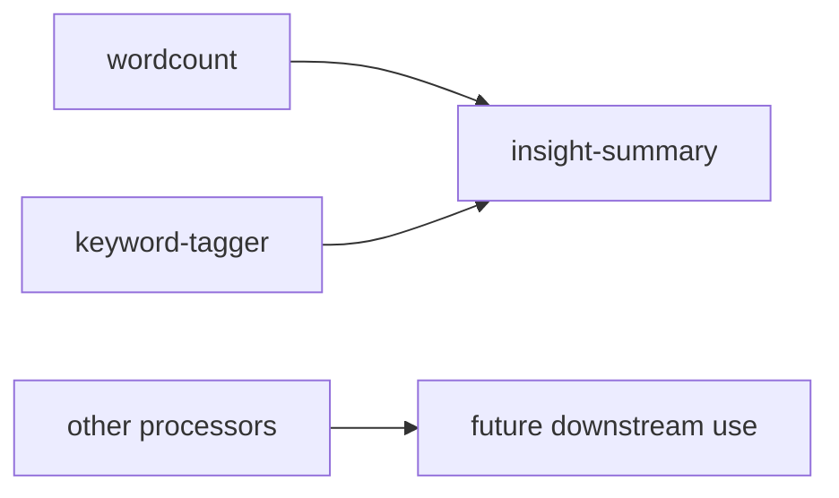
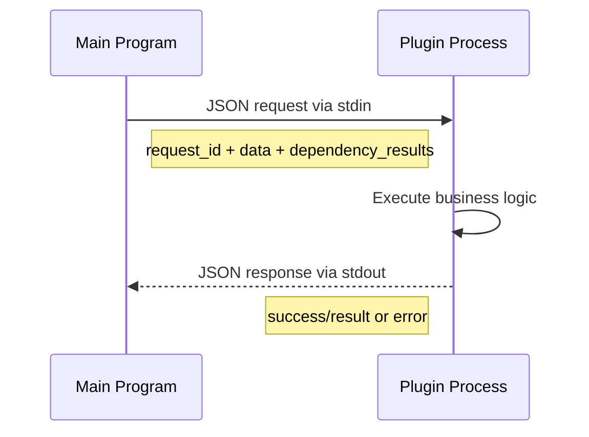
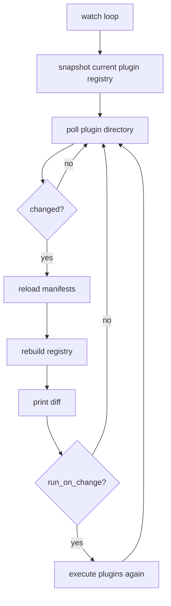

# Architecture Guide

这个文档用图和简短说明解释系统如何工作，重点展示模块边界、依赖编排、协议交互和热重载流程。

## 1. System Context

说明：

- 用户通过 CLI 驱动主程序。
- 主程序负责加载插件、建立执行计划、启动插件进程、汇总结果。
- 每个插件运行在独立进程中，主程序只与协议交互，不与业务实现耦合。

## 2. Module View

说明：

- `app` 负责 CLI 和 `watch` 模式。
- `core` 负责主流程编排，是系统中枢。
- `loader` 负责扫描和校验 manifest。
- `registry` 负责保存插件索引。
- `executor` 负责启动插件进程、超时控制和结果解析。
- `version` 负责依赖版本约束匹配。
- `protocol` 和 `sdk` 构成主程序与插件的公共契约。

## 3. Plugin Lifecycle

说明：

- `error` 表示插件自身描述非法。
- `blocked` 表示插件本身没坏，但依赖条件不满足。
- `failed` / `timeout` 发生在运行期。
- 当策略为 `on_failure=disable` 时，失败插件会被自动禁用。

## 4. Dependency-Aware Execution

说明：

- `insight-summary` 依赖 `wordcount`，并可选读取 `keyword-tagger` 的结果。
- 主程序会先完成上游插件执行，再把结果放进请求上下文传给下游插件。
- 依赖不仅影响顺序，还影响数据流。

## 5. Request / Response Contract

说明：

- 请求体包含 `request_id`、输入数据和依赖结果上下文。
- 插件响应只需要返回结构化 JSON，不必感知主程序内部实现。
- 这是多语言扩展的关键点。

## 6. Watch Mode

说明：

- 当前实现是轮询型热重载，优点是简单、跨平台、易验证。
- 插件新增、删除、启用状态变化都会触发重载。
- 如果打开 `-run-on-change`，还能直接在变更后重新执行输入。

## 7. Design Strengths

这份设计的工程优势在于：

- 模块边界清楚，职责分离明确。
- 插件机制是真正解耦的，而不是主程序中的接口拼装。
- 错误处理覆盖加载期、依赖期、运行期三个阶段。
- 依赖编排、结果透传和热重载让系统有明显的扩展深度。

## 8. Recommended Review Order

阅读或演示时，推荐按这个顺序理解：

1. 先看为什么采用子进程协议而不是动态库插件。
2. 再看模块分层和核心执行流。
3. 再看依赖约束、降级策略和状态设计。
4. 最后看 `watch` 模式和未来扩展方向。
